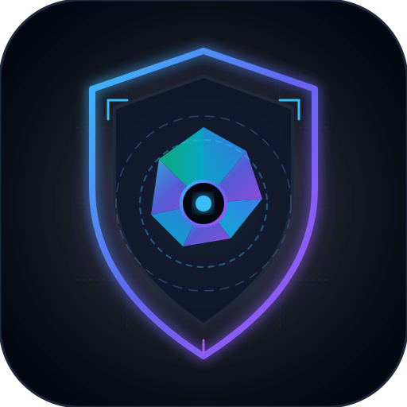
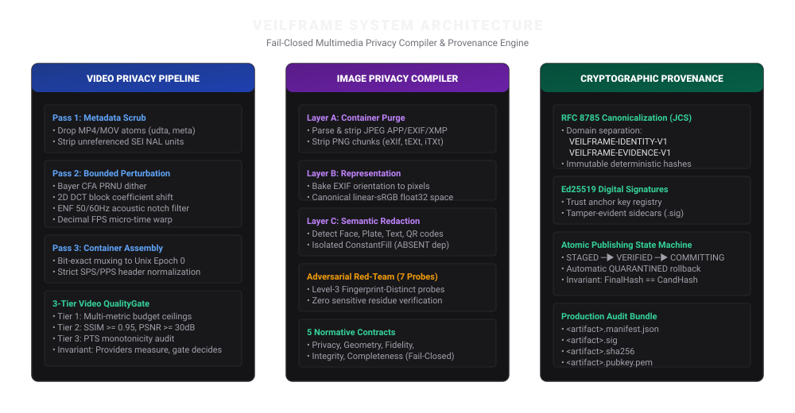
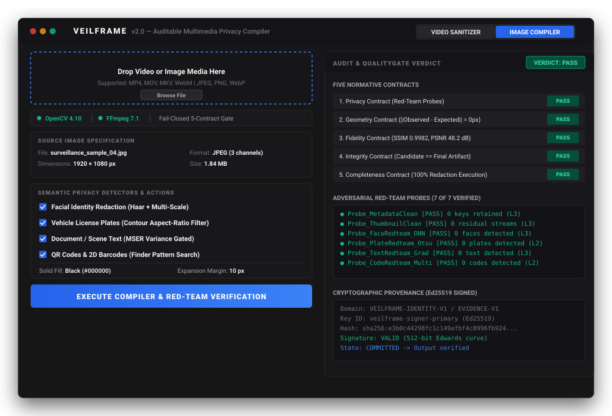
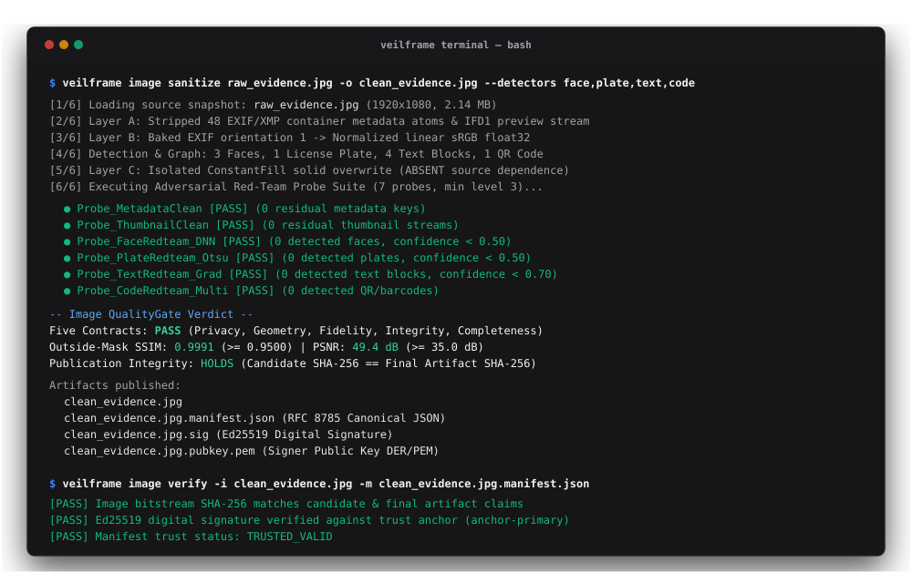

<p align="center">
  
  <br />
  <h1 align="center">VeilFrame</h1>
  <p align="center"><b>Auditable Multimedia Privacy Compiler, Bounded Forensic Disruption & Cryptographic Provenance</b></p>
</p>

<p align="center">
  <a href="https://github.com/sahir247/VeilFrame"></a>
  <a href="https://github.com/"></a>
  <a href="https://python.org/"></a>
  <a href="https://github.com/"></a>
  <a href="https://pyside.org/"></a>
  <a href="LICENSE"></a>
  <a href="https://ed25519.cr.yp.to/"></a>
  <a href="https://datatracker.ietf.org/doc/html/rfc8785"></a>
  <a href="#4-ai-project-intelligence--context-bundler-aibundle"></a>
</p>

---

**VeilFrame** is an advanced local multimedia sanitization, bounded forensic signal transformation, privacy compiler, and high-performance folder analyzer system with independent visual-fidelity verification and cryptographic provenance. Unlike standard metadata strippers that only modify container headers or paint superficial blur filters, **VeilFrame** operates across four core domains:

1. **Video Domain:** Applies bounded, orthogonal signal perturbations across spatial geometry, temporal cadence, physical sensor noise (Bayer CFA PRNU), transform-domain perceptual hashes (2D DCT), ISP chrominance drift, and acoustic Electrical Network Frequency (ENF) hums within strict **5% or 10% transformation policy budgets**, guarded by an **independent read-only three-tier visual fidelity gate**.
2. **Image Domain:** Compiles images through a deterministic multi-layer privacy compiler (Layer A Container Stripping, Layer B Representation Normalization, Layer C Isolated Solid Redaction), audited against **7 Level-3 Fingerprint-Distinct independent red-team probes** and enforced by a normative **5-Contract QualityGate** (Privacy, Geometry, Fidelity, Integrity, Completeness).
3. **Folder & Storage Domain:** High-performance selective directory analyzer, parallel cryptographic hasher, SQLite indexing engine, and staged duplicate candidate detector with **full uncut 64-character SHA-256 reporting** across interactive HTML dashboards, Markdown inventory tables, CSV, JSON, and text reports.
4. **AI Project Intelligence & Context Bundler (`.aibundle`):** Deterministic codebase packaging for LLMs and AI coding agents. Uses polyglot heuristics across 14 languages, modular syntax-preserving secret redaction, PathSpec `.gitignore` parsing, AST/syntax signature outlining, lockfile summarization, and priority knapsack budgeting to generate structured context bundles (`.aibundle`, Markdown, HTML, JSON, ZIP) with a zero-truncation guarantee on included source files.
5. **Cryptographic Provenance:** Every output is sealed with **RFC 8785 canonical JSON manifests** and **Ed25519 asymmetric digital signatures**.

---

##  System Architecture



VeilFrame is built upon the permanent architectural invariant:
> **"Providers measure. VeilFrame decides."**  
> No transformation engine, red-team detector, or metric provider ever determines whether media passes. Pass/fail verdicts are owned strictly and exclusively by the independent, read-only `QualityGate`.

---

##  Desktop Graphical Interface (GUI)

VeilFrame includes a modern desktop application built on PySide6 / Qt supporting Video, Image, Folder, and AI project analysis workflows with real-time feedback:



### GUI Key Capabilities:
- **4-Mode Segmented Switcher:** Seamlessly toggle between `Video Sanitizer`, `Image Privacy`, `Folder Analyzer`, and the dedicated `AI Project Lister` with automatic state persistence.
- **AI Project Lister Mode:** Desktop panel for generating LLM context bundles:
  - **Token Budget Presets:** Target ceilings (`32k`, `64k`, `128k`, `200k`, `1M`, `Unlimited`) with live token estimation.
  - **Selective Tree:** Checkbox tree with per-file token consumption counts and file pinning controls.
  - **Asynchronous Generation:** Background worker (`BundleGenerationWorker`) with cancel support to keep the interface responsive during large scans.
  - **Multi-Format Export & Clipboard:** One-click copy or file export across `.aibundle`, `.md`, `.html`, `.json`, `.zip`, and `.txt`.
- **Zero-Truncation Guarantee:** Selected source files are delivered in their entirety; no arbitrary code slicing.
- **Logical Collapsed Tree:** Collapses noisy dependency and build directories (`node_modules/ [EXCLUDED: dependency]`, `.venv/`) into single-line summaries to conserve token budget.
- **Hardware GPU Acceleration:** Auto-detects NVIDIA NVENC, Intel QuickSync, AMD AMF, and Apple VideoToolbox with graceful deterministic CPU fallback.
- **Universal Format Conversion:** Real-time transcoding and re-muxing across video (MP4, MKV, WebM, MOV, AVI, TS) and image (JPEG, PNG, WebP, TIFF, BMP, GIF, ICO, PPM) formats.
- **Forensic EXIF Metadata Inspector:** Live audit of device serials, camera models, capture timestamps, lens optics, and GPS geolocation alerts.
- **Intelligent Dependency Doctor:** On-demand detection and one-click automatic installation for FFmpeg and missing runtime tools with standard left `[Cancel]` / right `[OK]` controls.
- **Live Progressive Tree & Pulsing Telemetry:** Animated directory tree rendering during active scans with real-time throughput metrics (items/s) and millisecond timers.
- **Full SHA-256 Clipboard Copying:** Single-click or double-click to copy complete 64-character SHA-256 hashes, with rich right-click context menus.
- **Granular Semantic Detectors:** Toggle Face, License Plate, Text OCR, and QR/Barcode detectors with configurable safety margins.
- **5-Contract Visual Checklist:** Real-time verdict badges for Privacy, Geometry, Fidelity, Integrity, and Completeness.
- **Cryptographic Manifest Inspector:** View, inspect, and copy signed RFC 8785 canonical JSON audit manifests directly from the UI.

To launch the GUI:
```bash
veilframe gui
# or directly:
veilframe-gui
```

### Standalone Pre-Built Cross-Platform Packages:
Download pre-compiled native binaries, installers, mobile packages, and `SHA256SUMS.txt` from the [Latest Release](https://github.com/sahir247/VeilFrame/releases/latest):

| OS / Platform | Artifact | Architecture | Instructions |
|---|---|---|---|
| **Windows** | `VeilFrame-windows-x86_64.exe` | x86_64 | Run `.\VeilFrame-windows-x86_64.exe` (Standalone GUI & CLI) |
| **Linux (Debian/Ubuntu)** | `VeilFrame-linux-x86_64.deb` | x86_64 | Install `sudo dpkg -i VeilFrame-linux-x86_64.deb` (Desktop app + CLI) |
| **Linux (Portable)** | `VeilFrame-linux-x86_64.tar.gz` | x86_64 | Extract `tar -xzf VeilFrame-linux-x86_64.tar.gz` and run `./VeilFrame` |
| **macOS (Installer)** | `VeilFrame-macos-arm64.dmg` | Apple Silicon (ARM64) | Open DMG and drag **VeilFrame.app** to `/Applications` |
| **macOS (Portable)** | `VeilFrame-macos-arm64.tar.gz` | Apple Silicon (ARM64) | Extract `tar -xzf VeilFrame-macos-arm64.tar.gz` and open `VeilFrame.app` |
| **Android (APK)** | `VeilFrame-android-arm64.apk` | ARM64 (API 26+) | Sideload onto device via `adb install VeilFrame-android-arm64.apk` or direct install |
| **Python (Any OS)** | `veilframe-2.2.4-py3-none-any.whl` | Universal | `pip install veilframe-2.2.4-py3-none-any.whl` |

```powershell
# Windows Checksum Verification:
Get-FileHash -Path .\VeilFrame-windows-x86_64.exe -Algorithm SHA256
```
```bash
# Linux / macOS Checksum Verification:
sha256sum -c SHA256SUMS.txt --ignore-missing
```

---

##  Terminal Command-Line Interface (CLI)

VeilFrame provides a unified developer terminal interface styled with structured cards, ANSI tables, and progress indicators:



### CLI Commands Summary:
| Command | Description |
|---|---|
| `veilframe sanitize <video> -o <out>` | Multi-pass video sanitization with 3-tier QualityGate audit |
| `veilframe video compress <video> [opts]` | Video compression, visual timeline range trimming, downscaling & platform presets |
| `veilframe image sanitize <image> -o <out>` | Deterministic image compilation with 5-Contract QualityGate |
| `veilframe image compress <image> [opts]` | Smart image compression, Lanczos resize, EXIF scrub, rotation & color filters |
| `veilframe image verify <image> <manifest>` | Cryptographic image provenance and bitstream verification |
| `veilframe image inspect <image>` | Deep inspection of image EXIF, XMP, IPTC, and embedded thumbnails |
| `veilframe image doctor` | Diagnostics for neural detectors, OCR backends, and image libraries |
| `veilframe folder scan <dir>` | High-performance selective directory analysis with configurable presets |
| `veilframe folder dupes <dir>` | 3-stage duplicate file detection with wasted space calculations |
| `veilframe folder stats <dir>` | Summary size rollups, file type distributions, and directory depth |
| `veilframe folder export <dir> -o <out>` | Export comprehensive reports to interactive HTML, MD, JSON, CSV, TXT |
| `veilframe folder ai <dir> -o <out>` | Compile codebases into native `.aibundle` or Markdown AI context packages |
| `veilframe inspect <video>` | Deep inspection of container atoms, elementary streams, and GPS tags |
| `veilframe audit <ref> <trans>` | Independent visual-fidelity audit of reference vs transformed media |
| `veilframe verify <manifest>` | Standalone Ed25519 signature and SHA-256 bitstream verification |
| `veilframe doctor` | System diagnostic check for OS, Python, FFmpeg, and GPU encoders |
| `veilframe presets` | Interactive inspection of transformation presets and policy budgets |

---

##  Core Pipelines

### 1. Video Pipeline: Bounded Forensic Disruption

```
[Input Video]
     │
     ▼
[Pass 1: Pre-Sanitize] ──► Demux elementary streams, drop container atoms & SEI NALs
     │
     ▼
[Pass 2: Transform]    ──► Bayer CFA PRNU dither + 2D DCT median shift + ENF mains notch
     │
     ▼
[Pass 3: Post-Sanitize]──► Bit-exact packaging, timestamp zeroing (Epoch 0)
     │
     ▼
[Pass 4: QualityGate]  ──► 3-Tier Gate (Policy Budget + SSIM/PSNR Fidelity + Monotonic PTS)
     │
     ▼
[Pass 5: Audit Engine] ──► RFC 8785 Canonical JCS JSON + Ed25519 signature manifest
```

#### Mathematical Signal Transformations:
1. **Physical Bayer CFA PRNU Sensor Dither:**
   $$I_{\text{injected}} = \text{clip}\left(I_{\text{bayer}} + \beta \cdot I_{\text{bayer}} \cdot K \cdot \sin\left(\pi \cdot \frac{I}{255}\right)^\gamma, 0, 255\right)$$
2. **2D DCT Transform-Domain Perceptual Hash Perturbation:**
   $$X'(u_i, v_i) = \mu_{1/2} \pm \left(|X(u_i, v_i) - \mu_{1/2}| + \delta_{\text{shift}}\right)$$
   $$\|f_{\text{perturbed}}(x, y) - f_{\text{original}}(x, y)\|_\infty \le \epsilon \quad (\text{SSIM} \ge 0.95)$$
3. **Decoded YUV Total Variation Histogram Distance ($D_{TV}$):**
   $$D_{TV}(P_{\text{ref}}, P_{\text{trans}}) = \frac{1}{2} \sum_{i=0}^{255} |P_{\text{ref}}(i) - P_{\text{trans}}(i)| \in [0, 1]$$
4. **Electrical Network Frequency (ENF) Acoustic Notch:**
   Attenuates 50Hz, 60Hz, 100Hz, and 120Hz power-grid hums using high-Q multi-order IIR filters.

---

### 2. Image Pipeline: Deterministic Privacy Compiler

```
[Input Image]
     │
     ▼
[Layer A: Container]   ──► Strip EXIF, XMP, IPTC, vendor APP tags; purge preview thumbnails
     │
     ▼
[Layer B: Normalizer]  ──► Bit-depth to 8-bit, color mode to sRGB, coordinate geometry lock
     │
     ▼
[Layer C: Redaction]   ──► Isolated ConstantFill solid rectangles, safety margin expansion
     │
     ▼
[7 Red-Team Probes]    ──► Level-3 Fingerprint-Distinct audits (Face, Plate, OCR, QR, Fringe)
     │
     ▼
[5-Contract Gate]      ──► Privacy, Geometry, Fidelity, Integrity, Completeness
     │
     ▼
[Signed Manifest]      ──► Canonical RFC 8785 JCS + Ed25519 digital signature
```

#### Five Normative QualityGate Contracts:
- **Privacy Contract:** All Level-3 independent red-team probes return zero residual detections.
- **Geometry Contract:** Exact coordinate canvas preservation ($\|Observed - Expected\|_\infty = 0$).
- **Fidelity Contract:** Non-redacted pixels remain unaltered within mathematical budget limits ($D_{TV} \le \text{budget}$, $\text{SSIM} \ge \text{target}$).
- **Integrity Contract:** Every redacted pixel is strictly opaque with binary alpha ($\alpha \in \{0, 1\}$); partial alpha and blurring are forbidden.
- **Completeness Contract:** Redaction mask coverage strictly spans all requested privacy graph regions.

---

### 3. Folder Analyzer & Staged Duplicate Finder

```
[Target Directory]
        │
        ▼
[os.scandir() Traversal] ──► Selective field extraction (zero unselected field I/O overhead)
        │
        ├─────────────────────────────────────────────────┐
        ▼                                                 ▼
[SQLite Storage & Index]                          [3-Stage Duplicate Engine]
• Fast keyword search & filtering                 • Stage 1: Exact size partitioning (O(1))
• Extension distribution aggregation              • Stage 2: 16 KiB head/tail staged fingerprinting
• Directory depth rollups                         • Stage 3: Parallel streaming full SHA-256
        │                                                 │
        └────────────────────────┬────────────────────────┘
                                 │
                                 ▼
                     [Multi-Format Exporter]
             • Interactive HTML (Searchable Table + One-Click SHA Copy)
             • Markdown Inventory Table (Complete 64-char Hashes)
             • JSON, CSV, and Structured ASCII Text
```

---

### 4. AI Project Intelligence & Context Bundler (`.aibundle`)

VeilFrame includes an AI context compiler designed to package codebases into token-bounded context for Large Language Models (LLMs) and coding agents. It handles dependency filtering, credential redaction, lockfile summarization, and file prioritization without truncating included source files:

```
[Target Codebase]
        │
        ▼
[Pass 1: GitIgnore & Polyglot Heuristics] ──► PathSpec .gitignore engine, 14+ language identification
        │
        ▼
[Pass 2: Modular Security Engine]         ──► Language-family regex & entropy scanning; in-situ secret masking
        │
        ▼
[Pass 3: Content Optimizer]               ──► Lockfile summarization (uv.lock, package-lock.json), SQLite/binary schemas
        │
        ▼
[Pass 4: Priority Knapsack Selector]      ──► Greedy token allocation: entry points & core logic ranked over tests/docs
        │
        ▼
[Pass 5: Multi-Format Renderer]           ──► Native .aibundle v1, Markdown, interactive HTML, JSON, curated ZIP, Plain Text
```

#### The 10 Invariant Guarantees of VeilFrame AI Bundles:

1. **Zero-Truncation Guarantee:** Selected source files are never sliced or chopped into arbitrary fragments. An included file is delivered complete and syntactically intact. If a file does not fit the remaining token budget, it is cleanly deferred.
2. **Priority Knapsack Budgeting:** Operates under configurable token ceilings (presets: `32k`, `64k`, `128k`, `200k`, `1M`, or `Unlimited`). Uses a greedy knapsack algorithm ranking entry points (`priority >= 99`), core architecture, and configuration files first, followed by implementation files, documentation, and tests.
3. **Modular Syntax-Preserving Secret Redaction:** Employs language-specific regexes and Shannon entropy scanners to detect and mask credentials (AWS keys, GitHub tokens, Slack tokens, JWTs, private keys) with `[REDACTED]`, while avoiding false positives on benign method chains, Windows paths, documentation URLs, and package lockfile hashes.
4. **Credential Exclusion:** Sensitive key repositories and environment files (`.env`, `.env.*`, `*.pem`, `id_rsa`, `credentials.json`) are automatically excluded from the context payload and flagged in the security audit section.
5. **Collapsed Directory Summaries:** Summarizes vendor directories (`node_modules/ [EXCLUDED: dependency, 14,210 files]`, `.venv/ [EXCLUDED: environment, 4,120 files]`) to preserve directory topology without consuming token budget.
6. **AST & Syntax Structural Outlining:** When structural compression is requested, VeilFrame extracts Python AST signatures (`class`, `def`, docstrings) and brace-language declarations (TypeScript, Go, Rust, Java, C++) rather than raw line cuts.
7. **Lockfile Summarization:** Condenses large lockfiles (`uv.lock`, `package-lock.json`, `Cargo.lock`, `poetry.lock`) into concise package lists, stripping repetitive hashes and download URLs.
8. **Binary, Model & Database Summaries:** Inspects SQLite databases for table schemas and row counts; produces descriptive metadata for ML models and binaries instead of serializing raw bytes.
9. **Polyglot Ecosystem Detection:** Detects languages (14+ languages), frameworks (PySide6, React, Next.js, Django, FastAPI), package managers (`uv`, `npm`, `cargo`, `pip`), and build systems (`setuptools`, `vite`, `gradle`).
10. **Deterministic `.aibundle` v1 Text Protocol:** Plain UTF-8 format optimized for LLMs with standardized section delimiters (`@VEILFRAME_BUNDLE`, `@PROJECT`, `@SUMMARY`, `@TREE`, `@ECOSYSTEMS`, `@DEPENDENCIES`, `@ENTRY_POINTS`, `@RELATIONSHIPS`, `@FILE_INDEX`, `@FILES`, `@EXCLUDED`, `@SECURITY`, `@END`).

#### Native `.aibundle` v1 Format Specification:
```text
@VEILFRAME_BUNDLE
version=1
project=VeilFrame v2.2.0
root=/workspace/VeilFrame
timestamp=2026-09-17T00:00:00Z
total_tokens=94,520
included_files=64
excluded_files=182

@PROJECT
Name: VeilFrame v2.2.0
Detected Languages: Python, Kotlin, Shell, HTML, CSS
Detected Ecosystems: Python, Android, Gradle
Frameworks: PySide6, Qt
Package Managers: uv, pip, gradle
Total Files on Disk: 246 (42.8 MiB)
Included in Context: 64 files (~94,520 tokens)
...

@TREE
├── veilframe/
│   ├── core/ [INCLUDED: 12 files]
│   └── gui/ [INCLUDED: 24 files]
├── node_modules/ [EXCLUDED: dependency, 14,210 files]
└── .venv/ [EXCLUDED: environment, 4,120 files]

@DEPENDENCIES
• pyproject.toml: PySide6>=6.6.0, opencv-python>=4.8.0, cryptography>=41.0.0
• uv.lock: 84 resolved packages (hashes & URLs stripped)

@ENTRY_POINTS
• run.py | python | priority=100
• veilframe/gui/main_window.py | python | priority=99

@RELATIONSHIPS
• veilframe/gui/main_window.py -> veilframe/core/engine.py, veilframe/gui/folder_panel.py

@FILE_INDEX
ID   | Path | Type | Language | Size | Tokens
F001 | run.py | entry_point | python | 3.3 KiB | ~980
F002 | veilframe/gui/main_window.py | source | python | 18.2 KiB | ~4,210
...

@FILES
@FILE id="F001" path="run.py" type="entry_point" language="python"
<<<
[Complete, untruncated source code with inline secrets masked]
>>>

@EXCLUDED
node_modules/ | 14,210 files | dependency
.venv/ | 4,120 files | environment
tests/large_fixtures/ | 12 files | Context budget exhausted (budget remaining: 140 tokens)

@SECURITY
STATUS: SECURE | 0 credentials exposed
EXCLUDED CREDENTIAL FILES:
  • .env | excluded | Security exclusion (sensitive filepath pattern)
REDACTED INLINE SECRETS:
  • veilframe/config/remote.py | redacted | AWS Client Key

@END
```

#### Multi-Format Context Export:
| Format | Extension | Flag | Optimal Use Case |
|---|---|---|---|
| **VeilFrame Native** | `.aibundle` | `-f aibundle` | **Recommended.** Highest token-density delimiter format for LLMs (Claude, GPT, Gemini). |
| **Markdown** | `.md` | `-f markdown` | Human-readable documentation, GitHub PR reviews, chat interfaces with Markdown renderers. |
| **Interactive HTML** | `.html` | `-f html` | Self-contained single-page dashboard with syntax-highlighted code viewer, search, and copy tools. |
| **Structured JSON** | `.json` | `-f json` | Programmatic ingestion, agent workflows, CI/CD pipelines, and IDE plugin integrations. |
| **Curated Archive** | `.zip` | `-f zip` | Standalone zip file containing only selected, unexcluded, secret-redacted source files without bloat. |
| **Plain Text** | `.txt` | `-f text` | Minimalist ASCII format optimized for terminal pipes (`\| pbcopy`, `\| xclip`) and legacy utilities. |

---

### 5. Media Compression & Studio Engine (Image & Video Studios)

VeilFrame integrates a high-performance cross-platform compression and editing studio across Desktop GUI, Terminal CLI, and Mobile Android environments:

```
[Source Video or Image]
         │
         ├─────────────────────────────────────────────┐
         ▼                                             ▼
[Video Studio & Compressor]                  [Image Studio & Compressor]
• Visual Timeline Range Trimming             • Continuous Quality Compression (1%–100%)
  (Arbitrary start/end anywhere in video)    • Format Conversion (JPEG, PNG, WebP)
• Platform Target Ceilings (WhatsApp,        • Dimension Scaling (Lanczos Resampling)
  Discord, Email, Web)                       • Aspect-Ratio Cropping (Free, 1:1, 4:3, 16:9, 9:16)
• Resolution Scaling (1080p, 720p, 480p,     • Vectorized Color Grading (Grayscale, Sepia,
  360p) with Lanczos downscaling               Vintage, Cool, Warm)
• Aspect Ratio Cropping (9:16 Reel, 1:1,     • Lossless 90°/180°/270° & Free Rotation
  16:9, 4:3)                                 • Complete Zero-Leakage EXIF Scrubbing
• Playback Speed (0.5x–2.0x, audio sync)
• Audio Stream Controls (Keep, Mute,
  Compress AAC, Voice Mono)
```

#### Media Compression Presets & Target Ceilings:
| Profile | Target Size | Ideal Media / Delivery Platform | Mechanism |
|---|:---:|---|---|
| **WhatsApp Target** | `16 MB` | WhatsApp chat attachments & status updates | Multi-pass two-tier bitrate budget calculation with audio compression |
| **Discord Standard** | `25 MB` | Discord free-tier upload limit | Strict byte-bounded safety margin downscale |
| **Discord Nitro** | `50 MB` | Discord Nitro / Server boosted channels | High-bitrate 1080p/720p optimization |
| **Email Attachment** | `8 MB` / `25 MB` | Secure email gateways & mobile clients | Compact resolution downsampling + speech mono audio |
| **Web Optimized** | `10 MB` | Web streaming, portfolio media, documentation | Fast-start MOOV atom relocation (`+faststart`) with CRF 28 |
| **Social Reel / Shorts** | Variable | TikTok, Instagram Reels, YouTube Shorts | 9:16 vertical crop with synchronized `atempo` speed control |

---

##  Built-in Presets Comparison

| Feature / Policy Dimension | 5% Bounded Forensic Disruption | 10% Bounded Forensic Disruption | Privacy Clean |
|---|:---:|:---:|:---:|
| **Aggregate Policy Ceiling ($S_{\text{policy}}$)** | $\le 5.0\%$ | $\le 10.0\%$ | $0.0\%$ |
| **Spatial Geometry Ceiling ($\Delta_{\text{spatial}}$)** | $\le 2.0\%$ (99.8% Lanczos) | $\le 4.0\%$ (99.5% Lanczos, 2-4px crop) | $0.0\%$ (No crop/scale) |
| **Temporal Dynamics Ceiling ($\Delta_{\text{temporal}}$)** | $\le 1.0\%$ ($\pm 0.2\%$ speed) | $\le 2.0\%$ ($\pm 0.5\%$ speed, fractional FPS) | $0.0\%$ (Preserved) |
| **Luminance Drift Ceiling ($\Delta_{\text{luma}}$)** | $\le 1.0\%$ (0.5% luma, 1.5% gamma) | $\le 2.0\%$ (0.8% luma, 2.5% gamma) | $0.0\%$ (Original) |
| **Chrominance Drift Ceiling ($\Delta_{\text{chroma}}$)** | $\le 1.0\%$ (2.0% sat) | $\le 2.0\%$ (3.0% sat) | $0.0\%$ (Original) |
| **Frequency Noise Ceiling ($\Delta_{\text{freq}}$)** | $\le 1.0\%$ (Gaussian Noise Strength 8) | $\le 2.0\%$ (Bayer CFA PRNU Strength 16) | $0.0\%$ (Disabled) |
| **DCT Hash Perturbation** | Off | Enabled ($\text{SSIM} \ge 0.95$) | Off |
| **Audio ENF Notch Filtration** | 50/60/100/120 Hz, 0.99x pitch | 50/60/100/120 Hz, 0.985x pitch | Off |
| **Quality Gate: Mean SSIM Constraint** | $\ge 0.9500$ | $\ge 0.9000$ | $\ge 0.9500$ |
| **Quality Gate: Tail P5 SSIM Constraint** | $\ge 0.9000$ | $\ge 0.8500$ | $\ge 0.9000$ |
| **Quality Gate: Worst-Case SSIM** | $\ge 0.8500$ | $\ge 0.8000$ | $\ge 0.8500$ |
| **Quality Gate: Mean PSNR Constraint** | $\ge 30.0\text{ dB}$ | $\ge 28.0\text{ dB}$ | $\ge 30.0\text{ dB}$ |
| **Quality Gate: Worst-Frame PSNR** | $\ge 25.0\text{ dB}$ | $\ge 22.0\text{ dB}$ | $\ge 25.0\text{ dB}$ |
| **Metadata & SEI NAL Sanitization** | Full scrub | Full scrub | Full scrub |

---

##  Quickstart & Installation

### 1. Prerequisites
- **Python:** 3.10 or newer.
- **FFmpeg:** System FFmpeg with `ffprobe` on `PATH`.

### 2. Installation
```bash
# Clone the repository
git clone https://github.com/sahir247/VeilFrame.git
cd VeilFrame

# Install core package with image, video, and folder support
pip install -e .

# Install testing dependencies
pip install -e ".[test]"
```

### 3. Usage Examples

#### Video Sanitization
```bash
# Sanitize a video with standard 5% forensic disruption
veilframe sanitize input.mp4 -o sanitized.mp4

# Run with custom preset
veilframe sanitize input.mp4 -o sanitized.mp4 --preset "10% Bounded Forensic Disruption"

# Inspect raw container atoms
veilframe inspect input.mp4

# Verify signed audit manifest
veilframe verify sanitized_audit/manifest.json
```

#### Image Compilation
```bash
# Sanitize an image with automatic PII detection
veilframe image sanitize photo.jpg -o photo_clean.png

# Custom detectors and safety margins
veilframe image sanitize document.png -o doc_clean.png \
  --detectors face,plate,text,qr \
  --margin 12 \
  --fill "#000000"

# Verify cryptographic image provenance
veilframe image verify doc_clean.png doc_clean.manifest.json

# Deep inspection of container tags and thumbnails
veilframe image inspect photo.jpg
```

#### Folder Analysis & Duplicate Scanning
```bash
# Scan a directory with integrity checks (SHA-256) and export an interactive HTML report
veilframe folder scan ./my_directory -p integrity -e ./my_report.html

# Scan specifically for duplicate files with wasted space calculations
veilframe folder dupes ./my_directory -e ./duplicates_report.html

# Quick statistical overview of file types and size rollups
veilframe folder stats ./my_directory --json
```

#### AI Context Bundling & Program Lister (`veilframe folder ai`)
```bash
# 1. Compile codebase into native .aibundle v1 under standard 128k token context window
veilframe folder ai ./my_project -o ./my_project.aibundle

# 2. Compile into GitHub-flavored Markdown under an explicit 200,000 token budget
veilframe folder ai ./my_project -f markdown -t 200000 -o ./my_project.md

# 3. Compile into an interactive, self-contained single-page HTML viewer
veilframe folder ai ./my_project -f html -o ./my_project_bundle.html

# 4. Export clean, curated source archive (omitting caches, .venv, node_modules, and secrets)
veilframe folder ai ./my_project -f zip -o ./my_clean_source.zip

# 5. Machine-readable JSON payload for API ingestion and autonomous AI agent workflows
veilframe folder ai ./my_project -f json -t 64000 -o ./context.json

# 6. Exclude test suites, documentation, or configs to maximize room for core source logic
veilframe folder ai ./my_project -t 128000 --no-tests --no-docs -o ./core_logic.aibundle

# 7. Pipe directly to terminal stdout / system clipboard for immediate LLM pasting
veilframe folder ai ./my_project --stdout | pbcopy   # macOS
veilframe folder ai ./my_project --stdout | xclip    # Linux
veilframe folder ai ./my_project --stdout | Set-Clipboard  # Windows PowerShell
```

#### Media Compression & Studio (Image & Video)
```bash
# 1. Compress image to 80% quality with EXIF metadata stripped
veilframe image compress input.jpg -o compressed.jpg -q 80

# 2. Convert and resize image with cool filter and 90-degree rotation
veilframe image compress photo.png -o photo_art.webp -f WEBP --scale 0.75 --filter cool --rotate 90

# 3. Compress video to fit Discord 25MB ceiling with downscaled 720p HD
veilframe video compress movie.mp4 -o discord_share.mp4 --target-mb 25 --resolution 720p

# 4. Precision visual range trim: extract 4.0s to 6.0s span from a 10s video
veilframe video compress clip.mp4 -o trimmed.mp4 --trim-start 4.0 --trim-end 6.0

# 5. Crop video to 9:16 vertical Reel/Shorts with 1.5x speedup and muted audio
veilframe video compress raw.mp4 -o reel.mp4 --aspect 9:16 --speed 1.5 --audio mute
```

#### Desktop GUI (PySide6 / Qt)
Launch the unified multi-panel desktop application:
```bash
veilframe gui
```
The desktop application features 5 dedicated operational modes:
- **Video Sanitizer:** Multi-pass elementary stream extraction, Bayer CFA PRNU perturbation, 2D DCT median shift, and audio ENF notch filtration with live preview.
- **Image Privacy Compiler:** Multi-layer container scrubbing, linear sRGB normalization, isolated ConstantFill semantic redaction, and 7-probe adversarial red-team verification.
- **Media Compressor (New in v2.2.4):** Interactive image and video editing studio supporting visual timeline trimming, platform target size calculators (WhatsApp, Discord, Email, Web), resolution downscaling, color grading, and EXIF control.
- **Folder Analyzer:** High-performance directory tree scanning, SQLite indexing, and 3-stage duplicate file detection with interactive HTML export.
- **AI Project Lister:** Token-bounded `.aibundle` v1 compiler and security audit analyzer for feeding full project context into LLMs.

#### Android Native Mobile Application (`com.veilframe.app`)
VeilFrame provides a complete on-device Android application (API 26+ / Android 8.0 through Android 15, Target SDK 35):
- **Pure APK Signature Scheme V2/V3:** Release APKs strictly enforce V2/V3 block signing, disabling legacy V1 JAR signatures and preventing `META-INF/MANIFEST.MF` verification issues.
- **Mobile Image Studio:** Responsive single-page studio featuring live comparative before/after rendering, continuous quality slider (1%–100%), aspect cropping (Free, 1:1, 4:3, 16:9, 9:16), custom resizing, rotation, and EXIF control.
- **Mobile Video Studio:** Real-time dual-thumb visual timeline trimmer (`RangeSlider`) allowing trimming anywhere in the timeline (e.g. 4–6s out of a 10s clip), quick interval presets (Story 15s, Status 30s, Middle Half), platform size presets (WhatsApp 16MB, Discord 25MB, Email 8MB), and playback speed adjustments.
- **Cryptographic In-App Updates:** Automatic updates powered by `android/update.json`, monotonic integer `versionCode` checks, multi-hop S3 CDN redirect resolution, streaming SHA-256 validation, and auto-resuming unknown sources install.
- **Status Bar & Notch Handling:** Edge-to-edge window inset handling ensuring zero clipping under camera cutouts and system bars.

```bash
# Build standalone Android ARM64 APK (for testing, sideloading, or GitHub Releases)
./build.sh android-apk

# Build universal Android App Bundle (AAB for Google Play Console distribution)
./build.sh android-aab
```

---

##  Cryptographic Evidence Manifest

Every sanitized output generates an RFC 8785 canonical JSON manifest:

```json
{
  "schema_version": "2.0.0",
  "media_type": "image",
  "input_sha256": "e3b0c44298fc1c149afbf4c8996fb92427ae41e4649b934ca495991b7852b855",
  "output_sha256": "4a5e1e4baab89f3a32518a88c31bc87f618f76673e2cc77ab2127b7afdeda33b",
  "contracts": {
    "privacy": "PASS",
    "geometry": "PASS",
    "fidelity": "PASS",
    "integrity": "PASS",
    "completeness": "PASS"
  },
  "signature": {
    "algorithm": "Ed25519",
    "public_key_fingerprint": "SHA256:...",
    "signature_bytes_base64": "..."
  }
}
```

---

##  Limitations & Non-Guarantees

1. **Semantic Context:** VeilFrame neutralizes physical, acoustic, container, and pixel-level identifiers. It cannot obscure semantic text that the user opts not to redact (e.g., spoken dialogue).
2. **Extreme Adversaries:** Against determined manual human analysts with out-of-band context, manual inspection may still identify unredacted surroundings.
3. **Lossless Video Bit-for-Bit Identity:** Bounded forensic signal perturbation intentionally modifies pixel values within strict perceptual budgets; for 100% bitstream identity preservation, select the **Privacy Clean** preset.

---

##  License & Security

- **License:** MIT License. See [LICENSE](LICENSE) for details.
- **Security Policy:** See [SECURITY.md](SECURITY.md) for vulnerability reporting procedures and threat model documentation.
