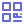
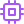

<p align="center">
  
  <br />
  <h1 align="center">VeilFrame</h1>
  <p align="center"><b>Offline-First Multimedia Engineering, Forensic Signal Transformation, AI Super-Resolution & Privacy Compilation Platform</b></p>
</p>

<p align="center">
  <a href="https://github.com/sahir247/VeilFrame"></a>
  <a href="https://github.com/"></a>
  <a href="https://python.org/"></a>
  <a href="https://kotlinlang.org/"></a>
  <a href="LICENSE"></a>
  <a href="https://ed25519.cr.yp.to/"></a>
  <a href="https://datatracker.ietf.org/doc/html/rfc8785"></a>
  <a href="#8-ai-project-intelligence--context-bundler-aibundle"></a>
</p>

---

## Executive Overview

**VeilFrame** is an offline-first, local-native multimedia engineering, signal transformation, and privacy compilation platform. Originally architected as a specialized bitstream privacy sanitizer, VeilFrame has evolved into a complete, standalone workstation spanning **8 specialized creative and forensic workspaces** across Mobile (Android) and Desktop (Windows, Linux, macOS).

VeilFrame requires zero cloud dependencies, guarantees 100% on-device data sovereignty, and enforces strict mathematical boundaries across all operations.

---

## Dedicated Workspaces & Tools

```
                             [ VeilFrame Core Engine ]
                                        │
        ┌───────────────────────────────┼───────────────────────────────┐
        ▼                               ▼                               ▼
 [ Creative Studios ]           [ Privacy Cleaners ]          [ Forensics & AI ]
 • AI Image Upscaler            • Video Sanitizer             • Folder Forensic Scanner
 • QR Code Studio (11 Modes)    • Image Privacy Compiler      • AI Context Bundler (.aibundle)
 • Video Studio & Trimmer                                     • Offline Markdown Studio
 • Image Studio & Compressor                                  • Cryptographic Provenance
```

| Workspace | Domain | Key Technology | Core Capabilities |
|---|---|---|---|
| **1. AI Image Upscaler** | Creative / AI | ONNX Runtime, Tiled Streamer | Real-ESRGAN, Anime 4B, UltraSharp, FBCNN deblocking, SCUNet denoising, smoothstep tile blending. |
| **2. QR Code Studio** | Creative / Utility | ZXing, CameraX, Canvas Engine | 11 artistic rendering modes, logo masking, background image embedding, live camera scanning, safe intent dispatch. |
| **3. Video Studio** | Creative / Video | FFmpeg 8.1.7, Media3 ExoPlayer | Visual timeline range trimming, target size ceilings (WhatsApp, Discord), rotation, aspect cropping, speed scaling. |
| **4. Image Studio** | Creative / Image | AndroidX ExifInterface, Lanczos | Continuous quality compression (1-100%), aspect cropping, lossless rotation, color grading filters, EXIF scrubbing. |
| **5. Video Cleaner** | Privacy / Forensics | Orthogonal Signal Engine | Bitstream SEI NAL scrub, Bayer CFA PRNU dither, 2D DCT median shift, acoustic ENF mains notch, 3-tier QualityGate. |
| **6. Image Cleaner** | Privacy / Forensics | Deterministic Compiler | Layer A container strip, Layer B sRGB normalize, Layer C solid redaction, 7 red-team probes, 5-contract QualityGate. |
| **7. Folder Scanner** | Forensics / Storage | SQLite3, Parallel Hasher | Selective directory traversal, staged 3-tier duplicate file detector, wasted space calculation, full 64-char SHA-256. |
| **8. AI Context Bundler** | Developer / LLM | PathSpec, Knapsack Allocator | Polyglot heuristics (14+ languages), zero-truncation guarantee, modular secret masking, lockfile summarization. |
| **9. Markdown Studio** | Productivity / Docs | Marked.js, KaTeX, Mermaid | Dual-pane live preview, offline KaTeX math rendering, local Mermaid diagram synthesis, split editor. |

---

##  System Architecture


VeilFrame adheres to a permanent architectural invariant:
> **"Providers measure. VeilFrame decides."**  
> No transformation engine, red-team detector, or metric provider ever determines whether media passes. Pass/fail verdicts are owned strictly and exclusively by the independent, read-only `QualityGate`.

---

## Workspace Deep-Dives

### 1.  AI Image Super-Resolution & Restoration

VeilFrame provides 100% offline, on-device neural super-resolution and image restoration powered by ONNX Runtime with tiled inference and streaming disk sinks:

- **State-of-the-Art Neural Models:**
  - `Real-ESRGAN x4plus`: High-fidelity universal restoration for blind real-world degradation.
  - `Real-ESRGAN Anime 4B / 6B`: Edge-preserving anti-aliasing for illustrations and animation frames.
  - `UltraSharp x4 V2 Lite`: Micro-texture synthesis and sharp high-frequency reconstruction.
  - `FBCNN Color`: Adjustable JPEG deblocking with dynamic strength conditioning (`[1, 1]` tensor inputs).
  - `SCUNet Color GAN`: Deep image denoising and color noise neutralization.
- **Tiled Inference with Seam-Free Blending:**
  - Configurable tile dimensions (`chunkSize` default 512px) with edge overlap (`overlap` default 32px).
  - Smoothstep cubic Hermite easing curve ($3x^2 - 2x^3$) for pixel-perfect tile stitching without visible seams.
  - Disk-backed memory streaming for ultra-high-resolution images (supporting images exceeding physical RAM).
- **Mathematical Fallbacks:** Native multi-lobe Lanczos-3, Bicubic, and Nearest Neighbor resampling for zero-hallucination mathematical fidelity.

---

### 2.  QR Code Studio (11 Artistic Modes & Scanner)

VeilFrame includes a comprehensive QR Code Studio supporting 11 artistic visual rendering modes powered by the VeilFrame Art Engine, accompanied by a live CameraX scanner:

- **11 Visual Rendering Modes:**
  1. `Basic`: Square modules with customizable corner shapes (rectangles, rounded, planets).
  2. `Bubble`: Organic cluster bubbles with distinct outline and inner core coloration.
  3. `2.5D`: Isometric 3D projection rendering top, left, and right illuminated cube faces.
  4. `DSJ`: Radial concentric position markers inspired by turntable geometry.
  5. `Image Fill`: Module-level image fill rendered via hardware `BitmapShader`.
  6. `Image Overlay`: Full background image compositing with contrast-preserving module masks.
  7. `Image Resample`: Pixelated image sampling into the QR grid with luminance weighting.
  8. `Line`: Interconnected horizontal and vertical stripe geometry.
  9. `Random Rectangle`: Seeded pseudo-random rectangular jitter for artistic layouts.
  10. `Function`: Procedural mathematical shape generation based on module coordinates.
  11. `Style Function`: Dynamic functional style compositing with secondary modulation.
- **Live CameraX Viewfinder Scanner:**
  - Real-time frame analysis using ZXing `PlanarYUVLuminanceSource`.
  - Custom targeting reticle overlay with corner bracket animations (`QrScanOverlayView`).
  - Static image decoding from device photo gallery.
- **Comprehensive Payload Parser (11 Formats):**
  - Instant parsing and safe intent dispatch for Wi-Fi (`WIFI:T:...;S:...;P:...;;`), UPI payments (`upi://pay`), URLs (with IDN homograph phishing defense), Phone (`tel:`), SMS (`smsto:`), Email (`mailto:`), Geo coordinates (`geo:`), Contacts (vCard/MeCard), Calendar events, and OtpAuth tokens.
  - User confirmation required before firing external action intents.
- **Vector & Raster Export:** Direct export to high-resolution PNG, JPEG, SVG path data, and PDF.

---

### 3.  Video Studio & Visual Compressor

Dedicated visual video compressor and editor powered by FFmpeg 8.1.7 and Media3 ExoPlayer:

- **Visual Timeline Range Trimmer:** Dual-thumb scrubber allowing arbitrary millisecond-accurate start/end range extraction with looping preview.
- **Platform Delivery Presets:**
  - `WhatsApp Target (16 MB)`: Multi-pass two-tier bitrate budget calculation with AAC audio compression.
  - `Discord Standard (25 MB)`: Byte-bounded safety margin compression for free-tier uploads.
  - `Discord Nitro (50 MB)`: High-bitrate 1080p/720p optimization.
  - `Email Attachment (8 MB / 25 MB)`: Compact resolution downsampling with speech mono audio.
  - `Web Optimized (10 MB)`: Fast-start MOOV atom relocation (`+faststart`) with CRF 28.
  - `Social Reel / Shorts`: 9:16 vertical crop with synchronized speed control.
- **Codec & Container Support:** Multi-codec encoding across H.264 (libx264), H.265 (libx265), VP9, and AV1 in MP4, MKV, WebM, MOV, and AVI containers.
- **Spatial & Temporal Controls:** 90°/180°/270° rotation, horizontal/vertical flip, custom margin crop slider (0-40%), and playback speed adjustment (0.5x to 2.0x with synchronized audio pitch).

---

### 4.  Image Studio & Creative Compressor

Deep image transformation and compression studio:

- **Continuous Quality Compression:** Precision quality scaling (1% to 100%) with real-time empirical output size estimation.
- **Dimension Scaling & Cropping:** Multi-lobe Lanczos resampling, arbitrary scaling, and aspect-ratio cropping (Free, 1:1, 4:3, 16:9, 9:16).
- **Color Grading Presets:** Color matrix transforms for Grayscale, Sepia, Vintage, Cool, and Warm tone grading.
- **Lossless Transform & EXIF Management:** 90-degree step rotations, arbitrary free rotation, alpha background fills, and zero-leakage metadata scrubbing.

---

### 5.  Video Privacy & Bounded Forensic Disruption

VeilFrame applies bounded, orthogonal signal perturbations across physical and transform domains to disrupt forensic re-identification while preserving perceptual visual quality:

```
[Input Video] ──► [Pass 1: Demux & Strip] ──► [Pass 2: Transform Signal] ──► [Pass 3: QualityGate] ──► [Signed Output]
```

- **Physical Bayer CFA PRNU Sensor Dither:**
  $$I_{\text{injected}} = \text{clip}\left(I_{\text{bayer}} + \beta \cdot I_{\text{bayer}} \cdot K \cdot \sin\left(\pi \cdot \frac{I}{255}\right)^\gamma, 0, 255\right)$$
- **2D DCT Transform-Domain Perceptual Hash Perturbation:**
  $$X'(u_i, v_i) = \mu_{1/2} \pm \left(|X(u_i, v_i) - \mu_{1/2}| + \delta_{\text{shift}}\right)$$
- **Acoustic Electrical Network Frequency (ENF) Mains Filter:**
  High-Q multi-order IIR notch filters targeting 50 Hz, 60 Hz, 100 Hz, and 120 Hz power-grid hums.
- **Independent Three-Tier QualityGate:**
  Enforces Mean SSIM $\ge 0.95$, Tail P5 SSIM $\ge 0.90$, Worst-Case SSIM $\ge 0.85$, Mean PSNR $\ge 30.0\text{ dB}$, and strictly monotonic presentation timestamps ($PTS_{i+1} > PTS_i$).

---

### 6.  Image Privacy Compiler

A deterministic multi-layer privacy compiler audited against independent adversarial red-team probes:

- **Layer A (Container Stripping):** Bitstream scrubbing of EXIF, XMP, IPTC, maker notes, and preview thumbnails.
- **Layer B (Representation Normalization):** Quantization normalization to standard 8-bit depth and sRGB color space.
- **Layer C (Isolated Solid Redaction):** ConstantFill solid rectangular masks with configurable safety margins.
- **Adversarial Red-Team Probes:** Audited by 7 independent Level-3 detectors (Face, License Plate, Text OCR, QR/Barcode, Boundary Fringe).
- **Five Normative QualityGate Contracts:**
  - *Privacy Contract:* Zero residual detections from red-team probes.
  - *Geometry Contract:* Exact coordinate canvas preservation ($\|Observed - Expected\|_\infty = 0$).
  - *Fidelity Contract:* Non-redacted pixels remain unaltered within mathematical budget limits ($D_{TV} \le \text{budget}$, $\text{SSIM} \ge \text{target}$).
  - *Integrity Contract:* Redacted pixels are strictly opaque with binary alpha ($\alpha \in \{0, 1\}$); partial alpha and blurring are forbidden.
  - *Completeness Contract:* Redaction coverage strictly spans all requested privacy graph regions.

---

### 7.  Folder Forensics & Staged Duplicate Finder

High-performance selective directory analyzer and cryptographic duplicate candidate detector:

- **Optimized Scanning:** Fast `os.scandir()` traversal extracting only requested attributes with zero unneeded file I/O.
- **SQLite3 Persistent Indexing:** Immediate search, extension distribution aggregation, and directory depth rollups.
- **Staged 3-Tier Duplicate Engine:**
  - *Stage 1:* Exact byte-size partitioning ($O(1)$ elimination of unique files).
  - *Stage 2:* 16 KiB head/tail staged fingerprinting.
  - *Stage 3:* Streaming full SHA-256 calculation for confirmed candidates.
- **Comprehensive Reporting:** Export full uncut 64-character SHA-256 reports to interactive HTML dashboards, Markdown inventory tables, CSV, JSON, and structured text.

---

### 8.  AI Project Intelligence & Context Bundler (`.aibundle`)

Deterministic codebase packaging compiler designed for Large Language Models (LLMs) and autonomous AI coding agents:

- **Zero-Truncation Guarantee:** Selected source files are delivered in their entirety; no arbitrary middle-slicing or truncated code fragments.
- **Priority Knapsack Budgeting:** Operates under configurable token ceilings (`32k`, `64k`, `128k`, `200k`, `1M`, or `Unlimited`). Entry points and core architecture are prioritized over tests and secondary docs.
- **Modular Syntax-Preserving Secret Masking:** Language-specific regexes and Shannon entropy scanners mask credentials (AWS keys, GitHub tokens, private keys) with `[REDACTED]` while avoiding false positives on URLs or paths.
- **Structural Outlining & Summaries:** AST signature extraction for Python, brace-language outlining (TypeScript, Go, Rust, Java, C++), lockfile condensation (`uv.lock`, `package-lock.json`), and SQLite schema extraction.
- **Multi-Format Export:** Generates `.aibundle` v1, Markdown, interactive single-page HTML, structured JSON, and curated ZIP archives.

---

### 9.  Offline Markdown Studio & Live Editor

Integrated offline GitHub Flavored Markdown (GFM) workspace:

- **Dual-Pane Live Preview:** Instant split-view or full-screen rendering of GFM documentation.
- **Offline Diagram & Formula Rendering:** Embedded Mermaid diagram synthesis and KaTeX mathematical typesetting without internet access.
- **Productivity Features:** Table of contents generator, document structure outlining, syntax-highlighted code blocks with 1-click clipboard copy, in-page search, dirty-state back navigation protection, and New Markdown Maker.

---

## Desktop Graphical Interface (GUI)

VeilFrame includes a local desktop application built on PySide6 / Qt:


```bash
# Launch the desktop GUI
veilframe gui
# or directly:
veilframe-gui
```

### Standalone Pre-Built Packages:

| OS / Platform | Artifact | Architecture |
|---|---|---|
| **Windows** | `VeilFrame-windows-x86_64.exe` | x86_64 (Standalone GUI & CLI) |
| **Linux (Debian/Ubuntu)** | `VeilFrame-linux-x86_64.deb` | x86_64 (Desktop app + CLI) |
| **Linux (Portable)** | `VeilFrame-linux-x86_64.tar.gz` | x86_64 (Standalone portable executable) |
| **macOS (Installer)** | `VeilFrame-macos-arm64.dmg` | Apple Silicon (ARM64) |
| **macOS (Portable)** | `VeilFrame-macos-arm64.tar.gz` | Apple Silicon (ARM64) |
| **Android (APK)** | `app-debug.apk` / `VeilFrame-android-arm64.apk` | ARM64 / Universal (API 26+) |
| **Python Package** | `veilframe-2.2.8-py3-none-any.whl` | Universal (`pip install`) |

---

##  Terminal Command-Line Interface (CLI)


### CLI Commands Reference:

| Command | Action |
|---|---|
| `veilframe sanitize <video> -o <out>` | Multi-pass video privacy sanitization with 3-tier QualityGate audit |
| `veilframe video compress <video> [opts]` | Video compression, visual range trimming, resolution scaling & platform presets |
| `veilframe image sanitize <image> -o <out>` | Deterministic image compilation with 5-Contract QualityGate |
| `veilframe image compress <image> [opts]` | Image compression, Lanczos resize, EXIF scrub, rotation & color grading |
| `veilframe image verify <image> <manifest>` | Cryptographic image provenance and bitstream verification |
| `veilframe image inspect <image>` | Deep inspection of image EXIF, XMP, IPTC, and embedded thumbnails |
| `veilframe folder scan <dir>` | High-performance selective directory analysis with configurable presets |
| `veilframe folder dupes <dir>` | 3-stage duplicate file detection with wasted space calculations |
| `veilframe folder stats <dir>` | Statistical size rollups, file type distributions, and directory depth |
| `veilframe folder export <dir> -o <out>` | Export comprehensive reports to interactive HTML, MD, JSON, CSV, TXT |
| `veilframe folder ai <dir> -o <out>` | Compile codebase into `.aibundle` v1, Markdown, HTML, JSON, or ZIP |
| `veilframe inspect <video>` | Deep inspection of container atoms, elementary streams, and GPS tags |
| `veilframe audit <ref> <trans>` | Independent visual-fidelity audit of reference vs transformed media |
| `veilframe verify <manifest>` | Standalone Ed25519 signature and SHA-256 bitstream verification |
| `veilframe doctor` | System diagnostic check for OS, Python, FFmpeg, and GPU encoders |

---

##  Policy Presets Comparison

| Feature / Policy Dimension | 5% Forensic Disruption | 10% Forensic Disruption | Privacy Clean |
|---|:---:|:---:|:---:|
| **Aggregate Policy Ceiling ($S_{\text{policy}}$)** | $\le 5.0\%$ | $\le 10.0\%$ | $0.0\%$ |
| **Spatial Geometry Ceiling ($\Delta_{\text{spatial}}$)** | $\le 2.0\%$ (99.8% Lanczos) | $\le 4.0\%$ (99.5% Lanczos, 2-4px crop) | $0.0\%$ (No crop/scale) |
| **Temporal Dynamics Ceiling ($\Delta_{\text{temporal}}$)** | $\le 1.0\%$ ($\pm 0.2\%$ speed) | $\le 2.0\%$ ($\pm 0.5\%$ speed) | $0.0\%$ (Preserved) |
| **Luminance Drift Ceiling ($\Delta_{\text{luma}}$)** | $\le 1.0\%$ (0.5% luma, 1.5% gamma) | $\le 2.0\%$ (0.8% luma, 2.5% gamma) | $0.0\%$ (Original) |
| **Chrominance Drift Ceiling ($\Delta_{\text{chroma}}$)** | $\le 1.0\%$ (2.0% sat) | $\le 2.0\%$ (3.0% sat) | $0.0\%$ (Original) |
| **Frequency Noise Ceiling ($\Delta_{\text{freq}}$)** | $\le 1.0\%$ (Gaussian Noise) | $\le 2.0\%$ (Bayer CFA PRNU) | $0.0\%$ (Disabled) |
| **DCT Hash Perturbation** | Off | Enabled ($\text{SSIM} \ge 0.95$) | Off |
| **Audio ENF Notch Filtration** | 50/60/100/120 Hz | 50/60/100/120 Hz | Off |
| **Quality Gate: Mean SSIM** | $\ge 0.9500$ | $\ge 0.9000$ | $\ge 0.9500$ |
| **Quality Gate: Worst-Case SSIM** | $\ge 0.8500$ | $\ge 0.8000$ | $\ge 0.8500$ |
| **Quality Gate: Mean PSNR** | $\ge 30.0\text{ dB}$ | $\ge 28.0\text{ dB}$ | $\ge 30.0\text{ dB}$ |
| **Metadata & SEI NAL Scrub** | Full scrub | Full scrub | Full scrub |

---

##  Cryptographic Evidence Manifest

Every sanitized output generates an RFC 8785 canonical JSON manifest signed with Ed25519:

```json
{
  "schema_version": "2.0.0",
  "media_type": "image",
  "input_sha256": "e3b0c44298fc1c149afbf4c8996fb92427ae41e4649b934ca495991b7852b855",
  "output_sha256": "4a5e1e4baab89f3a32518a88c31bc87f618f76673e2cc77ab2127b7afdeda33b",
  "contracts": {
    "privacy": "PASS",
    "geometry": "PASS",
    "fidelity": "PASS",
    "integrity": "PASS",
    "completeness": "PASS"
  },
  "signature": {
    "algorithm": "Ed25519",
    "public_key_fingerprint": "SHA256:...",
    "signature_bytes_base64": "..."
  }
}
```

---

##  Quickstart & Installation

```bash
# Clone the repository
git clone https://github.com/sahir247/VeilFrame.git
cd VeilFrame

# Install core package
pip install -e .

# Install testing dependencies
pip install -e ".[test]"

# Run test suite
pytest
```

---

##  Limitations & Non-Guarantees

1. **Semantic Context:** VeilFrame neutralizes physical, acoustic, container, and pixel-level identifiers. It cannot obscure semantic text that the user opts not to redact (e.g., spoken dialogue).
2. **Extreme Adversaries:** Against determined manual human analysts with out-of-band context, manual inspection may still identify unredacted surroundings.
3. **Lossless Video Bit-for-Bit Identity:** Bounded forensic signal perturbation intentionally modifies pixel values within strict perceptual budgets; for 100% bitstream identity preservation, select the **Privacy Clean** preset.

---

##  License & Security

- **License:** MIT License. See [LICENSE](LICENSE) for details.
- **Security Policy:** See [SECURITY.md](SECURITY.md) for vulnerability reporting procedures and threat model documentation.
